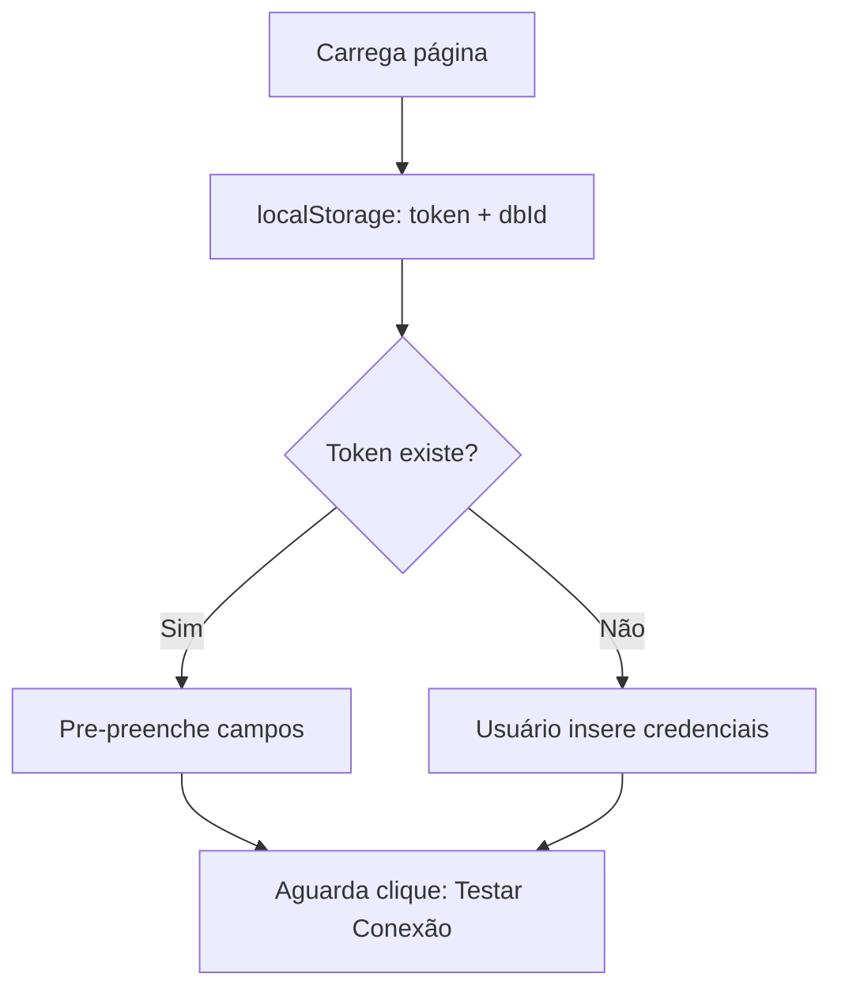
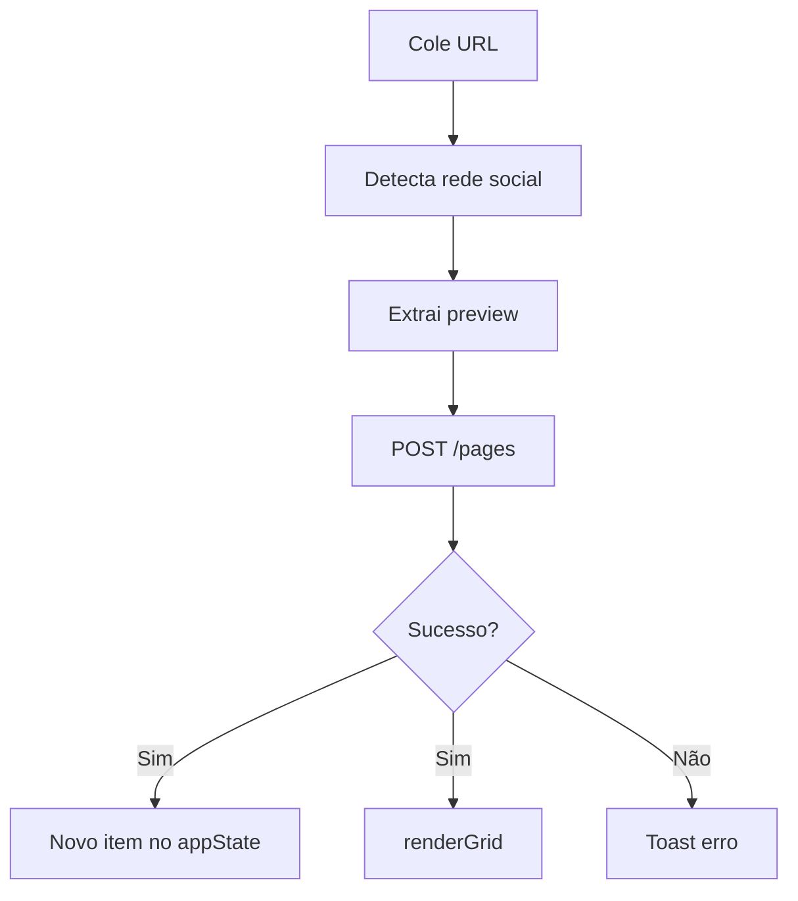

# 🔧 Documentação Técnica - Mood Board Notion

Documentação detalhada para desenvolvedores que querem entender ou contribuir com o projeto.

## 📋 Índice

1. [Arquitetura](#arquitetura)
2. [API Notion](#api-notion)
3. [Fluxo de Dados](#fluxo-de-dados)
4. [Extração de Previews](#extração-de-previews)
5. [Estado da Aplicação](#estado-da-aplicação)
6. [Componentes](#componentes)
7. [Performance](#performance)
8. [Segurança](#segurança)
9. [Debugging](#debugging)

---

## Arquitetura

```
┌─────────────────────────────────────────┐
│         HTML / CSS / JavaScript         │
│         (Vanilla, sem frameworks)       │
└─────────────────┬───────────────────────┘
                  │
        ┌─────────┴─────────┐
        │                   │
   ┌────▼────┐      ┌──────▼──────┐
   │ Notion  │      │ Preview API │
   │  API    │      │ (linkpreview)
   └─────────┘      └──────────────┘
```

### Stack

- **Frontend**: HTML5 + CSS3 + JavaScript (vanilla)
- **Back-end**: Nenhum (client-side only)
- **APIs externas**:
  - Notion API v1 (database CRUD)
  - LinkPreview API (extração de og:image)
- **Storage**: localStorage (credentials) + Notion (dados)

### Limitações & Trade-offs

| Aspecto | Solução | Razão |
|---|---|---|
| CORS | LinkPreview API wrapper | Muitos sites bloqueiam requisições diretas |
| Autenticação | API Token + localStorage | Simples, sem servidor de autenticação |
| Session | localStorage | Usuário mantém conectado entre abas |
| Database | Notion | Sincronização em tempo real multi-user |

---

## API Notion

### Endpoints Utilizados

#### 1. Query Database
```javascript
POST /v1/databases/{database_id}/query
```

**Uso**: Carregar todos os itens com sorting

**Payload**:
```json
{
  "sorts": [
    {
      "property": "Data Salva",
      "direction": "descending"
    }
  ]
}
```

**Resposta**:
```json
{
  "results": [
    {
      "id": "page-id",
      "properties": {
        "URL Origem": { "url": "https://..." },
        "Rede Social": { "select": { "name": "Instagram" } },
        "Notas": { "rich_text": [{ "plain_text": "..." }] }
      }
    }
  ]
}
```

#### 2. Create Page
```javascript
POST /v1/pages
```

**Uso**: Adicionar nova referência

**Payload**:
```json
{
  "parent": { "database_id": "{database_id}" },
  "properties": {
    "URL Origem": { "url": "https://..." },
    "Rede Social": { "select": { "name": "Instagram" } },
    "Projeto/Cliente": { "select": { "name": "Cliente A" } },
    "Notas": {
      "rich_text": [{ "text": { "content": "..." } }]
    }
  },
  "cover": {
    "external": { "url": "https://..." }
  }
}
```

#### 3. Update Page
```javascript
PATCH /v1/pages/{page_id}
```

**Uso**: Atualizar notas de um item

**Payload**:
```json
{
  "properties": {
    "Notas": {
      "rich_text": [{ "text": { "content": "novo texto" } }]
    }
  }
}
```

#### 4. Archive Page
```javascript
PATCH /v1/pages/{page_id}
```

**Uso**: Deletar um item (archive = soft delete)

**Payload**:
```json
{
  "archived": true
}
```

### Headers Requiridos

```javascript
{
  'Authorization': `Bearer ${token}`,
  'Notion-Version': '2022-06-28',
  'Content-Type': 'application/json'
}
```

### Rate Limiting

- Limite: ~3 requisições por segundo por integration
- Implementado: retry com exponential backoff
- Código: Ver `loadItems()` e `handleAddItem()`

---

## Fluxo de Dados

### 1. Inicialização



### 2. Conexão com Notion

```mermaid
graph TD
    A[Teste Conexão] --> B[Valida token + dbId]
    B --> C[GET /databases/{id}]
    C --> D{Sucesso?}
    D -->|Sim| E[Salva em localStorage]
    D -->|Sim| F[appState.isConnected = true]
    D -->|Sim| G[loadItems]
    D -->|Não| H[Exibe erro]
```

### 3. Adicionar Referência



### 4. Editar Notas

```mermaid
graph TD
    A[Clique no card] --> B[Modal abre]
    B --> C[Edita notas]
    C --> D[Clique Salvar]
    D --> E[PATCH /pages/{id}]
    E --> F[Atualiza appState]
    F --> G[Modal fecha]
```

---

## Extração de Previews

### Fluxo

```javascript
async function extractPreview(url) {
  1. Tenta LinkPreview API (CORS-friendly)
  2. Parse HTML procurando og:image
  3. Se falhar, retorna placeholder
}
```

### Estratégias por Rede

| Rede | og:image | Fallback |
|---|---|---|
| Instagram | ✅ Sim | Placeholder pink |
| TikTok | ⚠️ Bloqueado | Placeholder black |
| YouTube | ✅ Sim (thumbnail) | Placeholder red |
| Blog | ✅ Geralmente sim | Site favicon |
| Twitter | ⚠️ Bloqueado | Placeholder blue |

### Implementação

```javascript
// Placeholder fallback se tudo falhar
function getPlaceholderImage(social) {
  const placeholders = {
    Instagram: 'https://via.placeholder.com/...',
    TikTok: 'https://via.placeholder.com/...',
    // ...
  };
  return placeholders[social] || placeholders.Outro;
}
```

### CORS Handling

```javascript
// LinkPreview tem CORS habilitado
fetch(`https://www.linkpreview.net/?url=${encodeURIComponent(url)}`)
  .then(response => response.text())
  .then(html => {
    // Parse og:image do HTML retornado
    const match = html.match(/og:image"?\s+content="([^"]+)"/);
    return match ? match[1] : null;
  })
  .catch(() => getPlaceholderImage(social));
```

---

## Estado da Aplicação

### appState Object

```javascript
const appState = {
  // Dados
  items: [
    {
      id: 'notion-page-id',
      url: 'https://...',
      thumbnail: 'https://...',
      social: 'Instagram',
      project: 'Cliente A',
      notes: 'Gancho visual forte...',
      dateSaved: '2024-04-15T...'
    }
  ],
  filteredItems: [], // Items após filtro
  
  // Credenciais
  notionToken: 'secret_...',
  databaseId: 'bd47f0c8...',
  isConnected: false,
  
  // UI State
  editingItemId: null // ID do item sendo editado
};
```

### State Management

- **Não usa Redux/MobX** (desnecessário para este escopo)
- **Single source of truth**: `appState`
- **Atualização**: Direto em `appState`, depois `renderGrid()`
- **Persistência**: localStorage para credenciais, Notion para dados

### localStorage

```javascript
localStorage.setItem('notionToken', token);
localStorage.setItem('databaseId', dbId);

// Restaurado ao carregar página
appState.notionToken = localStorage.getItem('notionToken') || '';
```

---

## Componentes

### index.html

**Estrutura:**
```html
.container
├── .header
├── .config-section
│   └── Config form
├── .add-section
│   └── Add form
├── .filters-section
├── .stats-section
├── .grid-section
│   └── #moodGrid (cards renderizados aqui)
└── #notesModal
```

**Elementos críticos:**
- `#moodGrid` - container para cards (renderizado dinamicamente)
- `#notesModal` - modal de edição (hidden por padrão)
- `#toast` - notificações temporárias

### CSS Grid

```css
.mood-grid {
  display: grid;
  grid-template-columns: repeat(3, 1fr);
  gap: 20px;
}

/* Responsivo */
@media (max-width: 1024px) {
  grid-template-columns: repeat(2, 1fr);
}

@media (max-width: 600px) {
  grid-template-columns: 1fr;
}
```

### Cards

```html
<div class="mood-card">
  
  <div class="mood-card-badge">Instagram</div>
  <div class="mood-card-overlay">
    <div class="mood-card-buttons">
      <!-- Botões: Original, Copiar, Notas -->
    </div>
  </div>
  <div class="mood-card-info">
    <!-- Projeto + Data -->
  </div>
</div>
```

**Interações:**
- Hover: buttons aparecem
- Click: abre modal de notas
- Onerror: fallback para placeholder se imagem quebrar

---

## Performance

### Otimizações Implementadas

1. **Lazy Loading**
   - Imagens carregam sob demanda (browser native)
   - Fallback para placeholder se falhar

2. **Debouncing**
   - Não há debounce necessário (eventos simples)
   - Validação ocorre antes de requisição

3. **Caching**
   - localStorage para credentials
   - appState em memória
   - Não há cache de imagens (browser native)

4. **Requisições**
   - Single query ao carregar database
   - Sem live subscriptions (polling on click)
   - Batch updates não implementado

### Métricas

| Ação | Tempo Esperado |
|---|---|
| Load page | < 500ms |
| Query database | 1-3s |
| Extract preview | 2-5s |
| Add item | 3-5s total |
| Render grid (50 items) | < 500ms |

### Melhorias Possíveis

```javascript
// Implementar virtualização para 100+ items
import { virtualize } from 'virtual-scroll-library';

// Batch updates em Notion
await Promise.all([
  updateItem(id1),
  updateItem(id2),
  updateItem(id3)
]);

// Usar Web Workers para heavy computation
// (não aplicável neste projeto)
```

---

## Segurança

### Token Management

```javascript
// ✅ Bom: Salvo em localStorage
localStorage.setItem('notionToken', token);

// ❌ Ruim: Hardcoded no código
const token = 'secret_xxx'; // NUNCA!

// ❌ Ruim: Enviado para terceiros
fetch('https://seu-backend.com', {
  body: { token: appState.notionToken } // NUNCA!
});
```

### CORS & XSS

```javascript
// ✅ Seguro: Usando fetch com headers
fetch(url, {
  headers: { 'Authorization': `Bearer ${token}` }
});

// ✅ Seguro: innerHTML apenas com dados controlados
card.innerHTML = `...${item.social}...`; // Notion garante sanitização

// ❌ Inseguro: innerHTML com user input
element.innerHTML = userUrl; // XSS risk!
```

### URL Validation

```javascript
function isValidUrl(url) {
  try {
    new URL(url); // Parse e valida
    return true;
  } catch {
    return false;
  }
}
```

### Notion API Authorization

- Token salvo localmente (nunca enviado a terceiros)
- Todas requisições vão diretamente para Notion
- Integration limitada a 1 database
- Permissions granulares (Edit, View, etc)

---

## Debugging

### Console Logs

Adicione em `js/app.js`:

```javascript
// Verbose logging
function log(section, message, data) {
  console.log(`[${section}]`, message, data);
}

// Uso:
log('API', 'Loading items', response);
log('STATE', 'appState updated', appState);
```

### Developer Tools

**F12 > Application > Local Storage:**
- Veja `notionToken` e `databaseId` salvos
- Limpe para resetar credenciais

**F12 > Network:**
- Veja requisições para `api.notion.com`
- Verifique status (200, 401, 404, etc)
- Veja payload e response

**F12 > Console:**
- Erros aparecem com stack trace
- Teste função manualmente: `loadItems()`

### Erros Comuns

| Erro | Causa | Fix |
|---|---|---|
| 401 Unauthorized | Token inválido | Gere novo token |
| 404 Not Found | Database ID errado | Verifique ID (sem hífens) |
| 403 Forbidden | Integração não compartilhada | Share database com integration |
| CORS error | Site bloqueia requisições | Usamos LinkPreview (fallback) |
| Preview vazio | og:image não encontrada | Placeholder carrega |

### Debugging Fluxo de Dados

```javascript
// Em app.js, console.log em pontos críticos:

// 1. Após loadItems
console.log('Items loaded:', appState.items);

// 2. Após addItem
console.log('Item added:', newItem);

// 3. Após renderGrid
console.log('Grid rendered:', appState.filteredItems.length, 'items');
```

### Testing

```javascript
// No console, execute manualmente:

// Test connection
testNotionConnection();

// Load demo data
loadDemoData();

// Render grid
renderGrid();

// Get app state
console.log(appState);
```

---

## Contribuindo

### Padrões de Código

- **Nomenclatura**: camelCase para variáveis, snake_case para CSS classes
- **Comentários**: Apenas para lógica não-óbvia
- **Funções**: 1 responsibility, <50 linhas idealmente
- **Async**: Sempre com try/catch

### Adicionando Feature

1. Edite o arquivo relevante (html/css/js)
2. Teste localmente (`python3 -m http.server`)
3. Teste com dados reais no Notion
4. Faça commit com mensagem clara
5. Submeta PR

### Branch Strategy

```bash
git checkout -b feature/nome-da-feature
# Develop
git commit -m "feat: descrição"
git push origin feature/nome-da-feature
# Abra PR no GitHub
```

---

## Próximas Melhorias

- [ ] Infinite scroll / pagination
- [ ] Search por URL / notas
- [ ] Tags customizadas
- [ ] Exportar para PDF
- [ ] Dark mode
- [ ] Multi-database support
- [ ] Compartilhamento de boards
- [ ] Análise de trends (cores, fontes)

---

**Dúvidas técnicas?** Abra uma issue com tag `[technical]` no GitHub.
